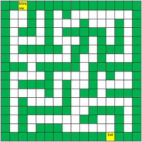

# Maze Solver


---


## Sample From PDF



Encoded as PDF MazeSampleFromPdf.txt

```
XX XXXXXXXXXXXXX
X  X X X       X
X  X X   X   X X
X XX X XXXXX X X
X    X   X X X X
X XXXXX XX XXX X
X       X  X   X
XXX XXXXX XXXXXX
X    X    X X  X
X XXXX X  X    X
X    X X XX XXXX
X X    X       X
X XXXXXX  XXXX X
X X      XX  X X
X X XXX      X X
XXXXXXXXXXXX XXX
```

---


## Main Method
A main method is defined in maze.solver.Main


---


## Provided Means To Launch Main
First build the project using Maven with the following command:
```
mvn package
```
Then use one of the following means to launch main:
* Bash launcher script [run.sh]
* Windows launcher script [run.bat]
* Run using Maven:
The following command will run the main method using maven.
```
mvn exec:java
```


---


## Example Output
```
INFO : reading maze sample text file: MazeSampleFromPdf.txt
INFO : maze sample text: [
XX XXXXXXXXXXXXX
X  X X X       X
X  X X   X   X X
X XX X XXXXX X X
X    X   X X X X
X XXXXX XX XXX X
X       X  X   X
XXX XXXXX XXXXXX
X    X    X X  X
X XXXX X  X    X
X    X X XX XXXX
X X    X       X
X XXXXXX  XXXX X
X X      XX  X X
X X XXX      X X
XXXXXXXXXXXX XXX
]
INFO : start vertex: 2,0
INFO : end vertex: 12,15
INFO : path: 2,0 S 2,1 W 1,1 S 1,2 S 1,3 S 1,4 S 1,5 S 1,6 E 2,6 E 3,6 S 3,7 S 3,8 W 2,8 W 1,8 S 1,9 S 1,10 E 2,10 E 3,10 E 4,10 S 4,11 E 5,11 E 6,11 N 6,10 N 6,9 N 6,8 E 7,8 E 8,8 S 8,9 S8,10 S 8,11 S 8,12 S 8,13 S 8,14 E 9,14 E 10,14 E 11,14 E 12,14 S 12,15
INFO : maze text with marked path: [
XXSXXXXXXXXXXXXX
X++X X X       X
X+ X X   X   X X
X+XX X XXXXX X X
X+   X   X X X X
X+XXXXX XX XXX X
X+++    X  X   X
XXX+XXXXX XXXXXX
X+++ X+++ X X  X
X+XXXX+X+ X    X
X++++X+X+XX XXXX
X X +++X+      X
X XXXXXX+ XXXX X
X X     +XX  X X
X X XXX +++++X X
XXXXXXXXXXXXEXXX]
```


---


## Graph Search Algorithm

https://en.m.wikipedia.org/wiki/Breadth-first_search

A non-recursive implementation of breadth-first search:
```
Breadth-First-Search(Graph, root):

	create empty set S
	create empty queue Q

	root.parent = NIL
	add root to S
	Q.enqueue(root)

	while Q is not empty:
		current = Q.dequeue()
		if current is the goal:
			return current
		for each node n that is adjacent to current:
			if n is not in S:
				add n to S
				n.parent = current
				Q.enqueue(n)
```
